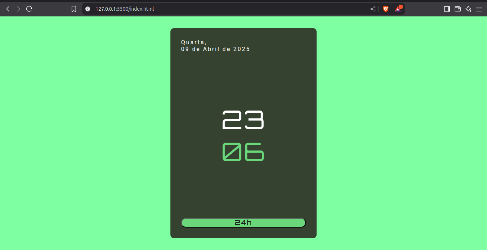

# Relógio Digital

Este projeto é um relógio digital simples desenvolvido utilizando HTML, CSS e JavaScript. Ele exibe a hora atual e atualiza automaticamente em tempo real.

## Demonstração

Você pode visualizar o relógio digital acessando o seguinte link: [https://xandeoliveira.github.io/relogiodigital/](https://xandeoliveira.github.io/relogiodigital/)




## Funcionalidades

- Exibição da hora atual com atualização em tempo real.
- Interface limpa e minimalista.

## Tecnologias Utilizadas

- HTML5
- CSS3
- JavaScript

## Como Executar o Projeto

1. Clone este repositório para o seu computador:

   ```bash
   git clone https://github.com/xandeoliveira/relogiodigital.git
   ```


2. Navegue até o diretório do projeto:

   ```bash
   cd relogiodigital
   ```


3. Abra o arquivo `index.html` em seu navegador de preferência.

## Estrutura do Projeto

- `index.html`: Arquivo principal que contém a estrutura HTML do relógio digital.
- `css/style.css`: Arquivo de estilos CSS para a apresentação visual do relógio.
- `js/script.js`: Arquivo JavaScript que implementa a lógica para exibir e atualizar a hora em tempo real.
- `img/image.png`: Imagem mostrada no início deste README.

## Contribuição

Contribuições são bem-vindas! Se você tiver sugestões ou melhorias, fique à vontade para abrir uma issue ou enviar um pull request.

## Licença

Este projeto está licenciado sob a Licença MIT. Consulte o arquivo [LICENSE](LICENSE) para obter mais informações.

---

Desenvolvido por [xandeoliveira](https://github.com/xandeoliveira).